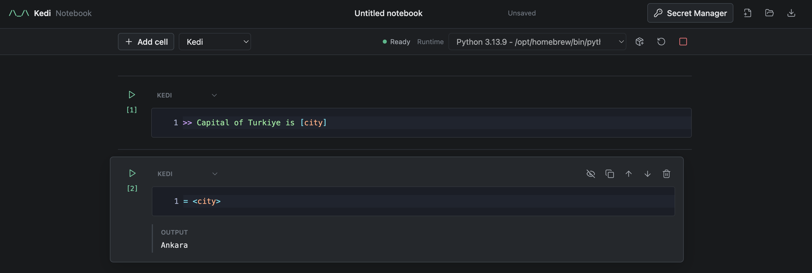

# Kedi Notebook

Kedi Notebook is the local, incremental notebook interface for the Kedi
Programming Language. It provides editable Kedi, terminal, and Markdown cells,
with either browser-owned Pyodide or a selected host Python interpreter.



## Install and Run

The notebook is currently distributed from a Kedi source checkout. Install its
local dependencies and start it in one command from the Kedi repository root:

```bash
uv run --extra notebook kedi notebook
```

This uses the checked-out `notebook` submodule and Kedi source rather than a
published package. For notebook development, use the root virtual environment:

```bash
../.venv/bin/python -m pytest tests
```

After syncing the extra, both entry points are equivalent:

```bash
kedi notebook
kedi-notebook
```

The default address is <http://127.0.0.1:8788/notebook/>. Add one or more host
Python installations explicitly when needed:

```bash
kedi-notebook --python /opt/homebrew/bin/python3.11
kedi notebook --python ~/.pyenv/versions/3.12.4/bin/python --port 8899
```

Use `--host`, `--port`, `--cwd`, and `--no-open` to control local serving.
Loopback serving requires no credentials. A non-loopback `--host` is rejected
unless `--token` or `KEDI_NOTEBOOK_TOKEN` is set; the browser opened by the CLI
receives that token without leaving it in the visible URL.

At startup, the notebook server loads `.env` from `--cwd` without overriding
variables already present in its process. Set `KEDI_ADAPTER_MODEL` there or use
`> model:` in a Kedi cell before invoking a template. Calling `load_dotenv()`
inside a host Python cell affects only that cell worker, not the server process
that owns adapters; browser Python cannot read the host project's `.env`.

The **Secret Manager** action in the top bar stores environment values outside
the notebook at `~/.kedi/notebook/secrets.json`. Stored values take precedence
over the server process and project `.env`, and the browser can list only their
names, never their values. Add a single value or import an arbitrary `.env`
path; relative paths resolve from `--cwd`. The store is atomically written with
user-only file permissions and is never included in browser storage. Saving,
importing, or deleting a value closes active sessions so the next cell starts a
runtime with the new environment.

## Runtime Model

Browser mode starts one persistent Pyodide worker as the page loads. Host mode
creates and reuses a project-specific virtual environment from the selected
Python executable, installs Kedi into it, and starts one persistent worker from
that environment. Kedi cells
execute incrementally against that session; completed cells remain editable
and rerunnable, and output is displayed under its source.

Every visible cell keeps its editor when focus moves elsewhere; inactive Kedi
cells retain syntax highlighting and can be edited or run directly. The cell
header can convert an individual cell between Kedi, Markdown, and Terminal.
Cells never collapse implicitly. Use the eye control to hide a cell explicitly;
the compact row remains available to show it again, and hidden state is saved
in `.kedinb` documents and local drafts.

Managed environments live under `~/.kedi/notebook/venvs` by default and have a
stable `kedi-notebook-py...` name derived from the base interpreter and working
directory. Set `KEDI_NOTEBOOK_ENV_HOME` to choose another root. The package
action beside a host runtime lists installed packages and installs newline-
separated requirement strings into the managed environment with streamed pip
output. The environment and installed packages persist across notebook server
runs while the directory remains available.

Cells beginning with `!` are terminal cells. Host commands run in the notebook
working directory, with `!python` and `!pip` bound to the managed environment.
Browser mode supports `!pip install`, `!uv add`, `!pip list`, `!echo`, and
`!pwd`. Terminal output streams into the active cell while it runs.

Use the square interrupt action while a cell is running. Interrupting replaces
the active Python worker, so the source remains rerunnable but live runtime
state is deliberately discarded. Host Kedi and terminal executions also stop
after 120 seconds; package installation has a 10-minute limit. Idle sessions
expire after 30 minutes.

Notebook execution is non-transactional. Rerunning a cell is a new execution
attempt against current state; it does not roll back previous side effects.
Displayed cell numbers follow notebook order and remain unchanged across
reruns. Adding, moving, or deleting cells recomputes affected positions.

Notebook files are validated before they replace the current document. The UI
warns before discarding unsaved changes and limits files to 5 MB, notebooks to
1,000 cells, individual cell source to 1 MB, and retained inline output to
200,000 characters. Output beyond that boundary is marked as truncated.

Downloading asks which form to save. **Just notebook** writes cell sources,
types, visibility, and layout without outputs or environment values. **Save
progress** also writes retained cell outputs/results and the strict,
pickle-free `InteractiveSession` snapshot containing the current KediEnv. It
never includes Secret Manager or process environment values. Opening a progress
file restores the Kedi session on the next execution. If any live value cannot
be represented without changing its semantics, progress download is rejected
instead of producing a partial snapshot.

## Editing

Kedi cells provide Tree-sitter highlighting, Kedi and embedded-Python
completion, hover, references, rename, live diagnostics, signature help,
definition navigation, and runtime error markers. Rename is limited to the
active cell when its LSP context includes earlier executed cells, avoiding a
silent partial edit. Monaco falls back to a plain multiline editor if its external assets
cannot be loaded. Markdown cells safely render headings, paragraphs, lists,
fenced code, blockquotes, emphasis, links, and separators; raw HTML is not
executed.

Use `Shift+Enter` to run the active cell, `Ctrl/Cmd+S` to download the notebook,
`Ctrl/Cmd+Enter` to insert after the active cell, `Ctrl/Cmd+Shift+Enter` to
append, `Ctrl/Cmd+Backspace` to delete, and `Ctrl/Cmd+ArrowUp/ArrowDown` to
move a cell. Toolbar actions expose the same operations.

Monaco is currently pinned on jsDelivr. Pyodide, its standard library, Micropip,
and Pydantic are vendored in the notebook wheel, so browser Python can start
without downloading its core runtime from a CDN. Packages installed later with
Micropip may still need network access. Host execution remains usable through
the fallback editor if Monaco is unavailable.
